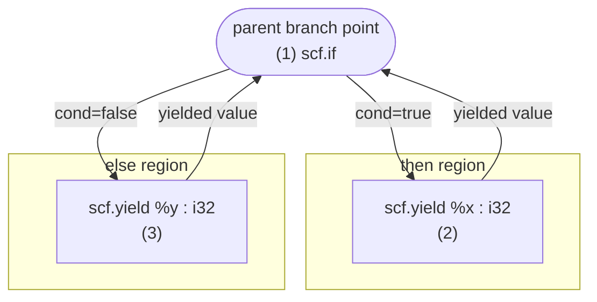
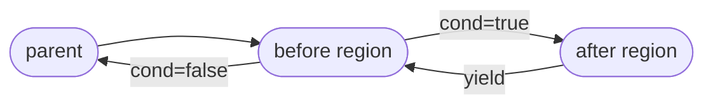
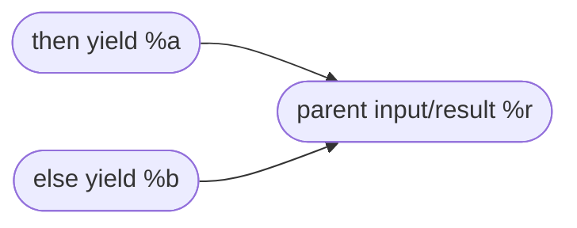
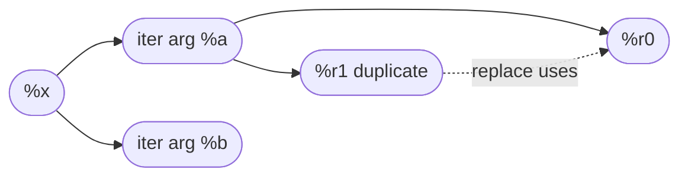

---
# try also 'default' to start simple
theme: default
fonts:
  mono: Comic Mono
  provider: none
# random image from a curated Unsplash collection by Anthony
# like them? see https://unsplash.com/collections/94734566/slidev
# some information about your slides (markdown enabled)
title: RegionBranchOpInterface
info: |
  ## Slidev Starter Template
  Presentation slides for developers.

  Learn more at [Sli.dev](https://sli.dev)
# apply UnoCSS classes to the current slide
class: text-center
# https://sli.dev/features/drawing
drawings:
  persist: false
# slide transition: https://sli.dev/guide/animations.html#slide-transitions
transition: slide-left
# enable Comark Syntax: https://comark.dev/syntax/markdown
comark: true
# duration of the presentation
duration: 35min
---

# {{$frontmatter.title}}


<div @click="$slidev.nav.next" class="mt-12 py-1" hover:bg="white op-10">
  Press Space for next page <carbon:arrow-right />
</div>

<div class="abs-br m-6 text-xl">
  <button @click="$slidev.nav.openInEditor()" title="Open in Editor" class="slidev-icon-btn">
    <carbon:edit />
  </button>
  <a href="https://github.com/slidevjs/slidev" target="_blank" class="slidev-icon-btn">
    <carbon:logo-github />
  </a>
</div>
---
layout: section
---

# LLVM and MLIR in General
## Because why not.

---
---

## Prerequisites

Stuff you should already be comfortable with before we jump into `RegionBranchOpInterface` and region control flow in MLIR.

<v-clicks>

- **LLVM (the codebase)** — how types and ADTs show up when you read MLIR/LLVM C++ headers
- **MLIR IR** — `Type`, `Value`, and `Operation`, since everything else hangs off these

</v-clicks>

<!--
Order: LLVM vocabulary and ADTs first (how the implementation is written),
then MLIR’s IR model (what those APIs are describing).
-->

---

## LLVM: `Type`, classes, and ADTs

**Two different meanings of “type”**

- **C++ `class` / templates** — how LLVM and MLIR *build* the compiler (`APInt`, `SmallVector<...>`, visitors, etc.).
- **`llvm::Type` (and friends)** — LLVM IR's idea of a type (integer, pointer, struct, ...) in classic LLVM IR.

When you read `include/llvm/` or `include/mlir/`, you are mostly in **C++ / LLVM ADT** land. When you read dialect ops and SSA, you are in **MLIR IR** land. In practice, both often appear in the same line of code.

---

## ADT: `APInt`

**Arbitrary-precision integers** with an explicit bit width - LLVM's go-to integer type for constants and anything that must match IR integer types exactly.

- Carries **width** and **signedness** the way IR expects (not "whatever `int` is on this platform").
- Used whenever exact bit-level behavior matters: widths, masks, alignment in bits, etc.
- Common helpers you will see: `getBitWidth()`, `isNegative()`, `isZero()`, and value extractors like `getZExtValue()` / `getSExtValue()`.
---

## ADT: `APInt`

- `zext` = **zero-extend** (pad with `0` bits), `sext` = **sign-extend** (copy the sign bit). Same raw bits, different interpretation.
- Two's complement example:
  - 8-bit `11111111` to 16-bit 
  - `zext` is `00000000 11111111` (255);
  - `sext` is `11111111 11111111` (-1).
- Declaring one is usually width + value, e.g. `APInt v(8, 255)` means "8-bit value with raw bits `11111111`".
- For signed meaning, you are still storing raw bits; signedness shows up when you *interpret* or *extract* (`isNegative()`, `getSExtValue()`, `getZExtValue()`).

---

## ADT: `APInt`

You do not need to memorize every API; just recognize **"this is not `int` / `long` - this is IR-accurate."**

Full header: `~/llvm/llvm-project/llvm/include/llvm/ADT/APInt.h`.

<<< @/snippets/llvm/ADT/APInt-class.h cpp {lines:true}{maxHeight:'120px'}

---

## ADT: `SmallVector` — what `<T, N>` allocates

`SmallVector<T, N>` means **`N` inline elements of `T`**, not `N` bytes.

- **`SmallVectorStorage<T, N>`** keeps a **raw byte buffer** for exactly **`N` objects**: `InlineElts[N * sizeof(T)]`, with **`alignas(T)`** so placement-new is safe.
- **`N == 0`**: special case - there is **no** `InlineElts` array (saves padding), but alignment still keeps **`getFirstEl()`** math valid.
- **`SmallVector<T, N>`** inherits that storage and passes **`N`** into **`SmallVectorImpl<T>(N)`** as starting inline capacity.
- Plain version: first `N` elements stay inside the object (fast, no malloc). Go past `N`, and it spills into a normal growable heap array (LLVM's own grow logic, not `std::vector` internally).

---

## ADT: `SmallVector` — what `<T, N>` allocates

Full file: `~/llvm/llvm-project/llvm/include/llvm/ADT/SmallVector.h`.

<<< @/snippets/llvm/ADT/SmallVector-inline.h cpp {lines:true}{maxHeight:'160px'}


---
class: text-left
---

## ADT: `SmallVector` — default `N` when you write `SmallVector<T>`

If you leave out **`N`**, LLVM aims for about a **64-byte** `sizeof(SmallVector<T>)` using `kPreferredSmallVectorSizeof = 64`. Let:

- $K = 64$ (bytes)
- $H = \text{sizeof}(\texttt{SmallVector<T,0>})$ — header-only footprint (no inline `T` objects yet)
- $s = \text{sizeof}(T)$

This is basically LLVM's `PreferredInlineBytes / sizeof(T)`, with a **minimum of one** inline slot:

$$
N_{\text{default}}
= \max\!\left(1,\ \left\lfloor \frac{K - H}{s} \right\rfloor\right)
$$

So if you do not pick `N` yourself, LLVM chooses a default `N` from the type size and that ~64-byte target.

---
layout: two-cols-header

---
## ADT: `SmallVector` — default `N` when you write `SmallVector<T>`

::left::

$$
N_{\text{default}}
= \max\!\left(1,\ \left\lfloor \frac{K - H}{s} \right\rfloor\right)
$$

<div class="m-5 rounded border border-gray-400/40 p-3 text-sm">
  <div class="mb-2 font-semibold">Memory picture (example: K=64, H=24, s=8)</div>
  <div class="mb-2 h-6 flex rounded overflow-hidden border border-gray-400/40">
    <div class="h-full bg-blue-500/70 text-white px-2 flex items-center" style="width:37.5%">Header H = 24B</div>
    <div class="h-full bg-emerald-500/70 text-white" style="width:62.5%">
      <div class="h-full w-full flex text-[10px]">
        <div class="h-full flex-1 border-l border-white/40 flex items-center justify-center">slot 1</div>
        <div class="h-full flex-1 border-l border-white/40 flex items-center justify-center">slot 2</div>
        <div class="h-full flex-1 border-l border-white/40 flex items-center justify-center">slot 3</div>
        <div class="h-full flex-1 border-l border-white/40 flex items-center justify-center">slot 4</div>
        <div class="h-full flex-1 border-l border-white/40 flex items-center justify-center">slot 5</div>
      </div>
    </div>
  </div>
</div>

$\left\lfloor \frac{K-H}{s} \right\rfloor = \left\lfloor \frac{40}{8} \right\rfloor = 5,\quad N_{\text{default}} = 5$

If $s$ is big, the inner fraction can become $0$ - that is why the code wraps it in $\max(..., 1)$.

If $s$ is really big, you can hit the **`static_assert`** in `CalculateSmallVectorDefaultInlinedElements`.

::right::

Then you must choose **`SmallVector<T, N>`** explicitly (pick `N` yourself).

```c++
struct MamaMia {
  DAMN BIG THINGS
}
```

When you're doing: `SmallVector<MamaMia>` you can get this static assert:
```c++
  static_assert(
      sizeof(T) <= 256, "You are trying to use
      a default number of inlined elements for "...
```

on which you need to do `SmallVector<MamaMia, 2>;`

---

## ADT: `SmallVector` 

**Example (LP64-ish, rounded for the slide):** take $K=64$, $H=24$, $s=8$ (for example, pointer-sized `T`).

$$
\left\lfloor \frac{64 - 24}{8} \right\rfloor = \left\lfloor \frac{40}{8} \right\rfloor = 5
\quad\Rightarrow\quad
N_{\text{default}} = 5
$$

With the same $K,H$ but $s=4$, you get $\lfloor 40/4 \rfloor = 10$ inline elements.

<<< @/snippets/llvm/ADT/SmallVector-default-N.h cpp {lines:true}{maxHeight:'140px'}

---

## ADT: equivalence classes

**Split things into disjoint groups** - "these belong together for analysis."

LLVM's **`EquivalenceClasses`** in `llvm/ADT/EquivalenceClasses.h` is a **Tarjan-style union-find**. Use it for **unification**, **value numbering**, and similar problems.

Quick example:
- Start with `{a} {b} {c} {d}`
- Learn constraints: `a == c`, `b == d`, then `c == d`
- Final classes become `{a, b, c, d}` (all merged into one agreement set)

<<< @/snippets/llvm/ADT/EquivalenceClasses-overview.h cpp {lines:true}{maxHeight:'100px'}

----

## ADT: equivalence classes

```cpp {maxHeight:'170px'}
llvm::EquivalenceClasses<int> EC;
EC.insert(1);
EC.insert(2);
EC.insert(3);

EC.unionSets(1, 2); // {1,2}
EC.unionSets(2, 3); // {1,2,3}

bool same = EC.isEquivalent(1, 3); // true
auto leader = EC.findLeader(1);    // representative iterator
```

Basically Simple UFDS....

---

## MLIR: `Type` and `Value`

A **`Type`** is MLIR's compile-time type object: it describes what a **`Value`** can represent (shapes, element types, dialect-specific attributes, etc.).

- Types are **interned**, so identity comparison is the usual MLIR pattern.
- Dialects can extend the type system, but the same `Type` layer is shared across dialects.

A **`Value`** is an SSA value: either an operation **result** or a **block argument** (including region entry arguments).

- **SSA**: each value has one definition, and use-def chains are explicit.
- Types travel with values: each `Value` has a queryable `Type`. You can do `value.getType()`

---

## MLIR: `Operation` and `Operation*` a.k.a `op`, `ops`.

An **`Operation`** is the core IR unit: **operands**, **results**, **attributes**, **regions**, and **nested blocks** all live there.

- **`Operation*`** is the normal handle when walking or rewriting IR (passes, patterns, interfaces).
- Regions belong to ops, and region terminators connect to **successors** described by interfaces.

So: **`Type`** = what it is, **`Value`** = SSA data, **`Operation*`** = where structure and control flow live.

---

## Prerequisites — checklist

| Topic | You should be able to... |
| --- | --- |
| `APInt` | Explain why fixed-width integer semantics live here, not in plain C++ ints |
| `SmallVector<T,N>` | Explain inline `N` elements (`N*sizeof(T)` bytes), default `N` (~64B object), and when it moves to heap storage |
| Equivalence classes | Read "merge these for analysis" as partition / union-find usage |
| MLIR `Type` / `Value` / `Operation*` | Follow operands, results, and regions while reading or debugging IR |

From here, region branch interfaces build directly on **regions + terminators + values crossing edges** - this is the foundation.
---
layout: section
---

# Control Flow Interfaces
## So many bugs... 🐛

---
---

## `ControlFlowInterfaces.cpp` — what is it? 🤔

`mlir/lib/Interfaces/ControlFlowInterfaces.cpp` is the runtime/utility implementation behind MLIR control-flow interfaces.

It is where interface contracts become **real checks and rewrite helpers**:

- `BranchOpInterface` / `WeightedBranchOpInterface`
- `RegionBranchOpInterface` / `RegionBranchTerminatorOpInterface`
- Canonicalization + inlining patterns driven by region branch semantics

---

## `ControlFlowInterfaces.cpp` — big buckets

1. **Verification** --- This part verifies the validity of the IR 👓
   - Branch successor operand counts/types
   - Branch/region weights validation
   - Region edge operand/input compatibility
2. **Region graph analysis** --- Bugs are usually here 🐛
   - Reachability, loops, and mutual exclusivity queries
3. **Dataflow mapping** --- It can get complicated because multi-edges 💯
   - Successor operand <-> successor input mappings
4. **Canonicalization patterns** --- If it fails, usually will trigger verification error
   - Make dead, remove dead, and deduplicate successor inputs
5. **Inlining helper pattern** --- Depends on Region graph analysis and Interface methods
   - Inline region-branch ops with one acyclic path

---
layout: two-cols
layoutClass: gap-8
---

## Regions in common SCF ops

A **region** is a nested CFG attached to an operation.  
Different ops own different numbers of regions:

- `func.func` -> **1 region** (function body region)
- `scf.if` -> **2 regions** (`then`, `else`; else may be empty)
- `scf.for` -> **1 region** (loop body)
- `scf.while`-- this one is funny, I had trouble handling this before, I feel Ingu had similar case too -> **2 regions** (`before` condition region, `after` loop-body region)
- `scf.execute_region` -> **1 region** (single nested executable region)

::right::

```mlir
func.func @demo(%cond: i1, %x: i32, %y: i32, %lb: index, %ub: index, %step: index, %init: i32) -> i32 { // 1 region: function body
%r = scf.if %cond -> (i32) {      // 2 regions: then/else
  scf.yield %x : i32
} else {
  scf.yield %y : i32
}

scf.for %i = %lb to %ub step %step { // 1 region: body
  scf.yield
}

%out = scf.while (%v = %init) : (i32) -> i32 { // 2 regions: before/after
^bb0(%arg: i32):
  scf.condition(%cond) %arg : i32
} do {
^bb1(%arg2: i32):
  scf.yield %arg2 : i32
}
  func.return %out : i32
}
```

This region count is exactly what `ControlFlowInterfaces.cpp` reasons about when it walks region successors.


---
layout: two-cols-header
---

Think of verification as a **socket compatibility check** on every edge.

::left::



::right::

<div class="code-wrap m-3">

```mlir
%c = arith.constant true
%x = arith.constant 1 : i32
%y = arith.constant 2 : i32

%r = scf.if %c -> (i32) {// (1) branch op produces i32
  scf.yield %x : i32     // (2) then edge forwards
                         //     i32 to parent result
} else {
  scf.yield %y : i32     // (3) else edge forwards
                         //     i32 to parent result
}
```
</div>

---
layout: two-cols
layoutClass: gap-8
---


::left::

```cpp
scf::IfOp ifOp = ...; // RegionBranchOpInterface op

SmallVector<RegionSuccessor> succs;
ifOp.getSuccessorRegions(/*point=*/std::nullopt, succs); // parent -> then/else

for (RegionSuccessor &succ : succs) {
  // If succ points to parent results, successor inputs are the "socket" being checked.
  // If succ points to a region, the matching edge values come from branch terminators
  // (for scf.if, the two scf.yield operands: (2) and (3)).
  OperandRange inputs = succ.getSuccessorInputs();
  (void)inputs;
}
```

Example of how it being used:

```c++
if (!regionOp)
  return std::nullopt;
// Add the control flow predecessor operands to the work list.
RegionSuccessor region = RegionSuccessor::parent();
SmallVector<Value> predecessorOperands;
```

::right::

```cpp
class RegionSuccessor {
public:
  /// Initialize a successor that branches to a region of the parent operation.
  RegionSuccessor(Region *region) : successor(region) {
    assert(region && "Region must not be null");
  }
  /// ...
  /// Initialize a successor that branches after/out of the parent operation.
  static RegionSuccessor parent() { return RegionSuccessor(); }

  // ...

  /// Return true if the successor is the parent operation.
  bool isParent() const { return successor == nullptr; }

private:
  /// Private constructor to encourage the use of `RegionSuccessor::parent`.
  RegionSuccessor() : successor(nullptr) {}
  Region *successor = nullptr;
};
```

---
layout: two-cols
---

::left::

`RegionBranchOpInterface` quick map:

- `getSuccessorRegions(point, succs)`: from a branch point (parent or terminator), list next `RegionSuccessor`s.
- `getEntrySuccessorRegions(operands, succs)`: constant-aware entry successor query (`ArrayRef<Attribute>`; null attr = non-constant operand).
- `getRegions() / getOperation()->getRegions()`: regions owned by the op (its control-flow graph nodes).
- parent op results + region block arguments are the "edge sockets" that `RegionSuccessor::getSuccessorInputs()` must match.

::right:: 

---
layout: two-cols
layoutClass: gap-8
---

`scf.while` example:

```mlir {maxHeight:'170px'}
%r = scf.while (%v = %init) : (i32) -> i32 {
// ----> Before region
^bb0(%arg0: i32):
  %cond = arith.cmpi slt, %arg0, %limit : i32
  scf.condition(%cond) %arg0 : i32
} do {
// ----> After region
^bb1(%arg1: i32):
  %next = arith.addi %arg1, %step : i32
  scf.yield %next : i32
}
```

For this `whileOp`, returns are:

- `whileOp.getRegions()` -> `[beforeRegion, afterRegion]`
- `whileOp.getSuccessorRegions(parent(), succs)` -> `[beforeRegion]`

::right::

- `whileOp.getEntrySuccessorRegions(operands, succs)` -> `[beforeRegion]` (`operands` is `ArrayRef<Attribute>` constants; default dispatches to parent successor query)
- `whileOp.getSuccessorRegions(beforeRegion, succs)` -> `[parent(), afterRegion]`
- `whileOp.getSuccessorRegions(afterRegion, succs)` -> `[beforeRegion]`
- `succ.getSuccessorInputs()` for successor=`parent()` -> values mapped to op results (`%r`)
- `succ.getSuccessorInputs()` for successor=`beforeRegion` -> values mapped to `before` block args (`%arg0`)
- `succ.getSuccessorInputs()` for successor=`afterRegion` -> values mapped to `after` block args (`%arg1`)


---
---

## Black-box method guide (`scf.while`)

```mlir
%r = scf.while (%v = %init) : (f32) -> i64 {
^bb0(%arg0: f32):
  %shared = call @shared_compute(%arg0) : (f32) -> i64
  %cond = call @evaluate_condition(%arg0, %shared) : (f32, i64) -> i1
  scf.condition(%cond) %shared : i64
} do {
^bb1(%arg1: i64):
  %next = call @payload(%arg1) : (i64) -> f32
  scf.yield %next : f32
}
```

Legend:
- `beforeRegion.getBlocks().front() = ^bb0`
- `afterRegion.getBlocks().front() = ^bb1`
- op result socket: `%r`
- region input sockets: `%arg0 : f32`, `%arg1 : i64`


---
---

```cpp
scf::WhileOp whileOp = ...;

// MutableArrayRef<Region> getRegions()
// return: [beforeRegion, afterRegion]
whileOp.getRegions();

// void getEntrySuccessorRegions(ArrayRef<Attribute> operands,
//                               SmallVectorImpl<RegionSuccessor> &regions)
// return (via out param): [beforeRegion]
whileOp.getEntrySuccessorRegions(operands, succs);

// void getSuccessorRegions(RegionBranchPoint point,
//                          SmallVectorImpl<RegionSuccessor> &regions)
// return (via out param): [beforeRegion]
whileOp.getSuccessorRegions(RegionBranchPoint::parent(), succs);
// return (via out param): [parent(), afterRegion]
whileOp.getSuccessorRegions(beforeRegion, succs);
// return (via out param): [beforeRegion]
whileOp.getSuccessorRegions(afterRegion, succs);
```

1. **Input**: what object/query goes in?
2. **Output**: what regions/values are produced?
3. **Reason**: how does verifier/dataflow use it?

---
---

```cpp
// OperandRange getEntrySuccessorOperands(RegionSuccessor successor)
// return: getInits() (entry-edge payload)
whileOp.getEntrySuccessorOperands(successor);

// ValueRange getSuccessorInputs(RegionSuccessor successor)
// return:
//   successor=parent()     -> op results (%r)
//   successor=beforeRegion -> block args (%arg0)
//   successor=afterRegion  -> block args (%arg1)
whileOp.getSuccessorInputs(successor);
```

1. **Input**: what object/query goes in?
2. **Output**: what regions/values are produced?
3. **Reason**: how does verifier/dataflow use it?

---

## `getRegions` + entry successor methods

- `whileOp.getRegions()`
  - **Input**: none
  - **Output**: regions owned by op, in order
  - **Returns**: `[beforeRegion, afterRegion]`
- `whileOp.getSuccessorRegions(RegionBranchPoint::parent(), succs)`
  - **Input**: parent entry branch point
  - **Output**: fills `succs`
  - **Returns**: `[beforeRegion]`
- `whileOp.getEntrySuccessorRegions(operands, succs)`
  - **Input**: `operands : ArrayRef<Attribute>` (**not** `ValueRange`; this is a constant-projection of runtime operands, null attr = non-constant)
  - **Output**: fills `succs`, optionally pruned by constants
  - **Returns**: `[beforeRegion]` for `scf.while`

---

## Real constant-projection example (LLVM source)

`scf::IfOp::getEntrySuccessorRegions` in `mlir/lib/Dialect/SCF/IR/SCF.cpp`:

```cpp
void IfOp::getEntrySuccessorRegions(ArrayRef<Attribute> operands,
                                    SmallVectorImpl<RegionSuccessor> &regions) {
  FoldAdaptor adaptor(operands, *this);
  auto boolAttr = dyn_cast_or_null<BoolAttr>(adaptor.getCondition());
  if (!boolAttr || boolAttr.getValue())
    regions.emplace_back(&getThenRegion());
  if (!boolAttr || !boolAttr.getValue()) {
    if (!getElseRegion().empty())
      regions.emplace_back(&getElseRegion());
    else
      regions.emplace_back(RegionSuccessor::parent());
  }
}
```

What this means:
- input is `ArrayRef<Attribute>` (`operands`), not `ValueRange`
- if condition is unknown (`nullptr`) -> keep both possible entry successors
- if condition is known -> keep only reachable successor(s)

---

## Constant projection: concrete `scf.if` outcomes

```mlir
%r = scf.if %cond -> i32 {
  %a = arith.constant 1 : i32
  scf.yield %a : i32
} else {
  %b = arith.constant 2 : i32
  scf.yield %b : i32
}
```

`getEntrySuccessorRegions(operands, succs)` returns:
- if projection says `%cond = true`  -> `succs = [thenRegion]`
- if projection says `%cond = false` -> `succs = [elseRegion]`
- if projection says `%cond = null`  -> `succs = [thenRegion, elseRegion]`

This is the "real" purpose: path pruning for analyses when constants are known.

Here it's `BoolAttr`, btw.

---

## `getSuccessorRegions(region, ...)`

```cpp
SmallVector<RegionSuccessor> succs;
whileOp.getSuccessorRegions(beforeRegion, succs);
// expected: [parent(), afterRegion]

succs.clear();
whileOp.getSuccessorRegions(afterRegion, succs);
// expected: [beforeRegion]
```

Input:
- source region (`beforeRegion` or `afterRegion`)
Output:
- all possible `RegionSuccessor`s from terminators in that region
Black box:
- from `beforeRegion`: exit the op or enter `afterRegion`
- from `afterRegion`: loop back to `beforeRegion`

---
layout: two-cols-header
layoutCols: gap-8
---

## `getEntrySuccessorOperands` vs `getSuccessorInputs`
<br>
::left::
- `whileOp.getEntrySuccessorOperands(successor)`
  - **Input**: destination successor on a parent-entry edge
  - **Output**: edge payload values that parent forwards
  - **Returns**: `getInits()` for `scf.while`
  - **Black box**: "Which values travel on the edge?"
::right::
- `whileOp.getSuccessorInputs(successor)`
  - **Input**: destination `RegionSuccessor`
  - **Output**: destination sockets that receive payload
  - **Returns for `scf.while`**:
    - successor=`parent()` -> op results (`%r`)
    - successor=`beforeRegion` -> block args (`%arg0`)
    - successor=`afterRegion` -> block args (`%arg1`)
  - **Black box**: "Where must payload land and type-match?"

---
layout: section
---

# CF Verifications
## Huft.. 🙂

---

## Verification helpers and failure modes

Verifier asks, edge-by-edge:

1. **Count check**: do both sides have the same number of values?
2. **Type check**: does position `i` have compatible types on both sides?
3. **Weight check** (if present): does weight count match successors/regions, and are they not all zero?

Here, **weight** means branch-likelihood metadata (relative probabilities), e.g. `[90, 10]` means "first successor is much more likely than second". Verifier checks the list shape and rejects degenerate all-zero weights.
---

## Verification helpers and failure modes
Core entry points in this file:

```cpp
detail::verifyBranchSuccessorOperands(...)
detail::verifyBranchWeights(...)
detail::verifyRegionBranchWeights(...)
detail::verifyRegionBranchOpInterface(...)
```

Fast fail intuition:

- edge carries `(%0 : i32, %1 : f32)` and destination expects `(%arg0 : i32)` -> arity error
- edge carries `(%0 : i32)` and destination expects `(%arg0 : i64)` -> type error

Custom op test-style MLIR example (`my.region_if` implements `RegionBranchOpInterface`):
---
layout: two-cols
layoutClass: gap-8
---

```mlir
// RUN: mlir-opt %s -split-input-file -verify-diagnostics

// --- PASS: one yielded i32 matches one op result i32 ---
%ok = my.region_if %cond -> (i32) {
  %x = arith.constant 1 : i32
  my.yield %x : i32
} else {
  %y = arith.constant 2 : i32
  my.yield %y : i32
}

```

<br>

```mlir
// --- FAIL #1: arity mismatch 
%bad_arity = my.region_if %cond -> (i32) {
  %a = arith.constant 1 : i32
  %b = arith.constant 0.5 : f32
  my.yield %a, %b : i32, f32
} else {
  %z = arith.constant 3 : i32
  my.yield %z : i32
}
```

::right::

```mlir
// --- FAIL #2: type mismatch
%bad_type = my.region_if %cond -> (i64) {
  %a = arith.constant 1 : i32
  my.yield %a : i32
} else {
  %b = arith.constant 2 : i32
  my.yield %b : i32
}
```


Without this layer, region dataflow rewrites are unsound because edges could carry ill-typed/ill-shaped payloads. Well, this runs at verifier step. There's this funny flag `--mlir-very-unsafe-disable-verifier-on-parsing` you can use to debug.

---
layout: two-cols-header
layoutClass: gap-8
---

## 2) Region graph algorithms (control-flow reasoning)
::left::

`traverseRegionGraph(...)` is the reusable workhorse: it explores successor regions via `getSuccessorRegions`.

Annotated MLIR loop-ish shape:

```mlir
%i = scf.while (%arg0 = %init) : (i32) -> i32 {
^bb0(%v: i32):
  %cond = arith.cmpi slt, %v, %limit : i32
  scf.condition(%cond) %v : i32      // (1) before -> after OR parent
} do {
^bb1(%w: i32):
  %next = arith.addi %w, %step : i32
  scf.yield %next : i32              // (2) after -> before
}
```


::right::

- `isRegionReachable(begin, r)` - "can I branch from begin to r?"
- `insideMutuallyExclusiveRegions(a, b)` - finds a shared enclosing `RegionBranchOpInterface` and checks non-reachability both ways
- `RegionBranchOpInterface::` `isRepetitiveRegion(index)` - detects self-reachability (looping region)
- `RegionBranchOpInterface::hasLoop()` - checks whether any entry region traversal revisits a region

---

## 3) Operand/input mapping utilities (dataflow plumbing)

Important API implemented in this file:

```cpp {maxHeight:'190px'}
RegionBranchOpInterface::getSuccessorOperandInputMapping(...)
RegionBranchOpInterface::getSuccessorInputOperandMapping(...)
RegionBranchOpInterface::getAllRegionBranchPoints()
RegionBranchOpInterface::getSuccessorOperands(src, dst)
RegionBranchOpInterface::getNonSuccessorInputs(successor)
```

Mental model:

- **Successor operands** = values forwarded *along an edge*.
- **Successor inputs** = destination values that receive those forwarded values
  (block args or op results).
- Mapping is built from all branch points (parent + region terminators).

Annotated MLIR mapping example:

```mlir {maxHeight:'170px'}
%r = scf.if %c -> (i32) {
  %a = arith.addi %x, %x : i32
  scf.yield %a : i32            // (1) operand on then->parent edge
} else {
  %b = arith.addi %y, %y : i32
  scf.yield %b : i32            // (2) operand on else->parent edge
}
// (3) parent successor input/result is %r : i32
```



Most later rewrite patterns depend on this mapping.

---

## 4) Canonicalization patterns in this file

Three patterns are registered by `populateRegionBranchOpInterfaceCanonicalizationPatterns(...)`:

1. `MakeRegionBranchOpSuccessorInputsDead`
   - Replaces a successor input with a unique reachable non-input value when dominance allows.
2. `RemoveDuplicateSuccessorInputUses`
   - Computes operand signatures and canonicalizes duplicate successor inputs.
3. `RemoveDeadRegionBranchOpSuccessorInputs`
   - Removes dead tied successor-input sets + corresponding operands, args, and results.

Key helper concepts:

- reachable values tracing (`computeReachableValuesFromSuccessorInput`)
- dominance/scope guard (`isDefinedBefore`)
- tied input sets via `llvm::EquivalenceClasses`

Annotated simplification example:

```mlir {maxHeight:'180px'}
%r0, %r1 = scf.for %iv = %lb to %ub step %st iter_args(%a = %x, %b = %x)
          -> (i32, i32) {
  scf.yield %a, %a : i32, i32    // (1) duplicate flow into both outputs
}
use(%r0, %r1)                    // (2) canonicalizer can fold %r1 -> %r0
```



---

## 5) Inlining support (`InlineRegionBranchOp`)

This pattern inlines when there is **exactly one acyclic path** through the region branch op.

Path is discovered with constant-aware successor resolution:

- extract constant attrs from operands
- query `getEntrySuccessorRegions` / terminator `getSuccessorRegions`
- reject multi-successor, cycles, multi-block unsupported cases

Then it:

- computes replacements for successor inputs (and non-successor inputs via callback),
- inlines blocks along the path,
- replaces the original op at the final parent successor.

Registered through `populateRegionBranchOpInterfaceInliningPattern(...)`.

Annotated one-path inlining idea:

```mlir {maxHeight:'180px'}
%r = scf.for %iv = %c5 to %c6 step %c1 iter_args(%arg = %0) -> (i32) {
  %n = arith.addi %arg, %iv : i32
  scf.yield %n : i32              // (1) single acyclic path parent->region->parent
}
use(%r)                           // (2) can become use(%n') after inlining
```


---

## How to read `ControlFlowInterfaces.cpp` efficiently

If you are reading for:

- **Verifier/debug errors** -> start at `verifyRegionBranchOpInterface`.
- **"Why did this branch op fold/canonicalize?"** -> read the 3 rewrite structs.
- **Loop/reachability behavior** -> read `traverseRegionGraph`, then `hasLoop` and `insideMutuallyExclusiveRegions`.
- **Inlining behavior** -> read `computeSingleAcyclicRegionBranchPath` and `InlineRegionBranchOp`.

This file is the bridge between interface declarations and real optimization/legalization behavior.

---

## Why this matters for canonicalization

Given the graph/dataflow above, the patterns in `ControlFlowInterfaces.cpp` can:

- replace successor inputs with unique reachable values when safe,
- remove dead/tied successor inputs and matching operands/results,
- deduplicate successor input uses with equivalent predecessor signatures.

That is why region branch ops (for/if/while-like) can simplify aggressively while staying structurally correct.
